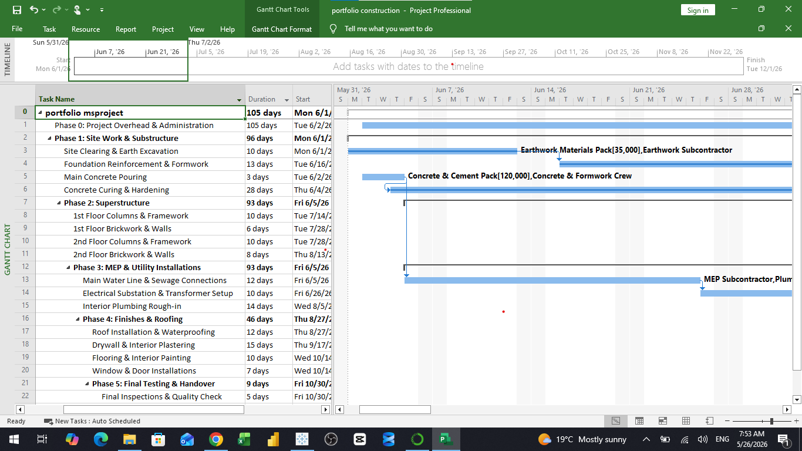

# Construction Project Analytics (2026)

This project focuses on the end-to-end management and analysis of construction projects, utilizing professional tools to ensure data-driven decision-making.

## Project Overview
The core objective of this project is to integrate scheduling and financial data to monitor project performance. By leveraging **MS Project** for detailed planning and **Power BI** for visual reporting, this project provides a comprehensive framework for tracking project timelines and costs.

## Technical Scope
* **Scheduling:** Developed a detailed project baseline using **MS Project**, establishing task dependencies and milestones.
* **Financial Tracking:** Managed and analyzed project costs to ensure alignment with budget requirements.
* **Data Visualization:** Built interactive dashboards to report project health, track progress, and facilitate resource allocation.

### Project Scheduling Visualization
The screenshot below displays the comprehensive project plan, including the Work Breakdown Structure (WBS) and timeline progression managed in MS Project:

## Repository Structure
* `project.mpp`: Original project schedule and resource data.
* `costs.pdf`: Detailed financial analysis and budget tracking report.
* `works.pdf`: Documentation of construction activities and work breakdown structure.
* `critical path .png`: Visual representation of project timeline constraints.
* `ms_project_gantt.png`: Full MS Project Gantt chart overview.

## Skills Demonstrated
* Proficiency in Project Management software (MS Project).
* Data visualization and reporting (Power BI).
* Analytical thinking in construction scheduling and cost management.
